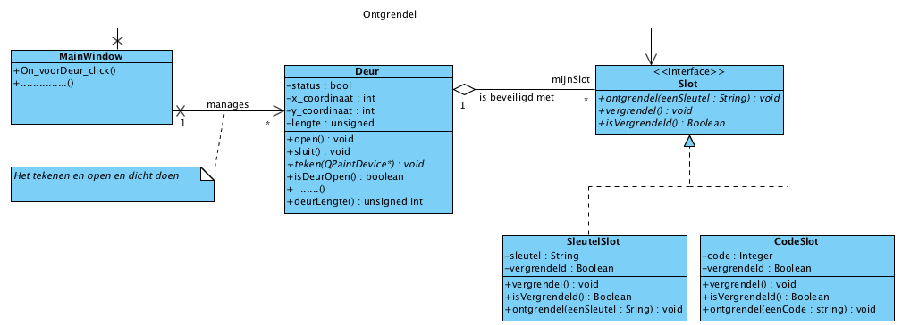
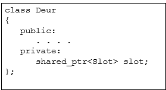
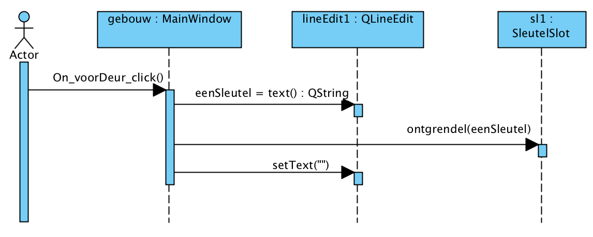
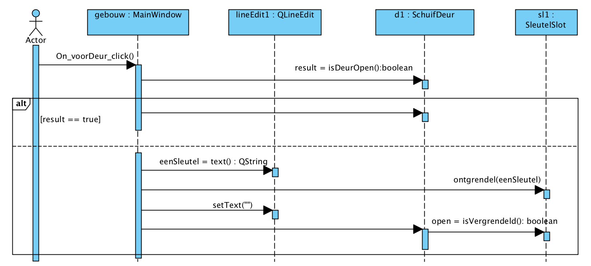

Technische Informatica Header

� John Viser

Laatste wijziging: 13 mei 2026
Opdracht 2 - Deuren beveiligen met sloten
In de vorige opdracht hebben we 2 type deuren gemaakt. Op de deuren die we aangemaakt hebben bevinden zich geen sloten. Meestal willen we juist dat een deur een bepaalde ruimte kan afsluiten. Om dit voor elkaar te krijgen brengen we een slot op elke deur aan. Een schematische weergave dat een deur ook een slot heeft wordt in figuur 1 gedaan. In figuur 1 is ook te zien dat er twee verschillende sloten zijn, een SleutelSlot en een CodeSlot.
De klasse Slot wordt hier weergegeven als een interface. Een interface houdt in dat die klasse geen eigen attributen heeft en dat alle methoden abstract zijn. In C++ wordt een abstracte methode weergegeven door =0 achter de betreffende methoden te zetten.
Een voorbeeld van een abstracte methoden is:

virtual void vergrendel()=0;

  

Figuur 1. Een deur heeft een slot

Een deur hoeft geen slot te hebben en een aanwezig slot kan worden vervangen. Er is dus spake van een aggregatie tussen Deur en Slot. Dit wordt in C++ gerealiseerd door een (non_const) private variabele van de klasse Deur te laten verwijzen naar een klasse Slot (zie figuur 2).

  
Figuur 2. Deur heeft een slotpointer

Maak de interface Slot en de klassen SleutelSlot en CodeSlot
Gebruik voor elke klasse/interface een aparte header file (.h) en een aparte implementatie file (.cpp).
Bedenk dat een Slot maar een eenvoudig ding is.
Een Slot heeft de volgende functionaliteit:
Het kan vergrendeld worden.
Het kan ontgrendeld worden.
Het ontgrendelen van het slot kan alleen wanneer aan de voorwaarde voldaan wordt. Dus de sleutel die past of de code die goed is.
De toestand (status) van het slot kan uitgelezen worden.

Een sleutel wordt gesimuleerd met een String. Een code wordt gesimuleerd met een Integer. Een SleutelSlot heeft dus een String als private variabele. Een CodeSlot heeft een Integer als private variabele.

Om een sleutelwaarde te kunnen invoeren wordt een QLineEdit-object (bijv. genaamd lineEdit1) gebruikt. De tekst (een sleutel of een code) wordt uit het betreffende QLineEdit-object gelezen en naar het gewenste Slot-object verzonden. Het Slot-object controleert of de tekst klopt. Klopt de tekst dan ontgrendelt het Slot-object zichzelf. Klopt de tekst niet dan gebeurt er niets. In figuur 3 wordt de sequence weergegeven die gevolgd wordt wanneer een Slot-object ontgrendeld wordt.

Wanneer een Deur sluit, wordt het Slot altijd vergrendeld.

Bedenk dat een slot onafhankelijk van deur ontgrendeld kan worden, maar de deur kan alleen open indien het slot ontgrendeld is.

Houd er rekening mee dat de klasse Slot gebruik maakt van std::string en niet van QString. Dit is om de klasse Slot herbruikbaar te houden waardoor deze ook in niet QT omgevingen gebruikt kan worden.

  
Figuur 3. Het ontgrendelen van een slot

Pas de klasse Deur van opgave 1 zodanig aan, dat een Deur-object naar een Slot-object kan verwijzen. Zoals in Figuur 2.

Een Deur-object kan pas open gaan wanneer het Slot-object ontgrendeld is. In figuur 4 wordt de sequence weergegeven die gedaan moet worden, wanneer op de bedieningsknop van de schuifdeur wordt geklikt (om een open Deur-object te sluiten, c.q. een gesloten Deur-object geprobeerd wordt te openen).

Laat de Schuifdeur naar een SleutelSlot verwijzen en een Draaideur naar een CodeSlot.

Figuur 4. Het openen en sluiten van een deur met een SleutelSlot

Deur	Type	Code/Sleutel
Voordeur (schuifdeur)	SleutelSlot	"geel"
Kamerdeur 1 (draaideur)	CodeSlot	1234
Kamerdeur 2 (draaideur)	CodeSlot	2468