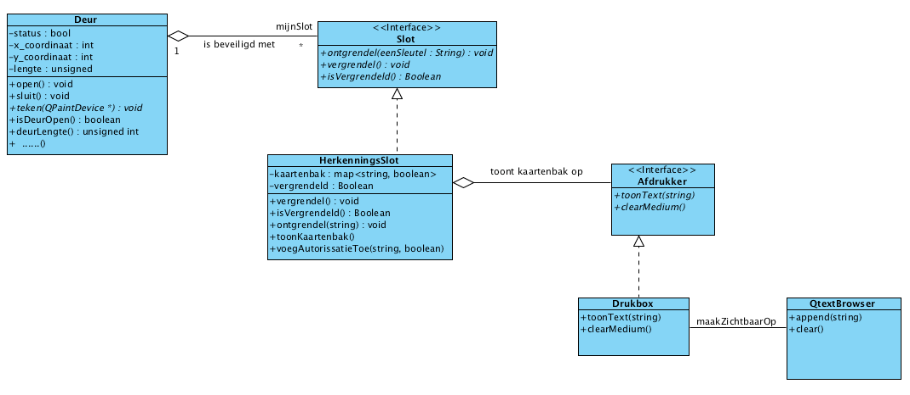
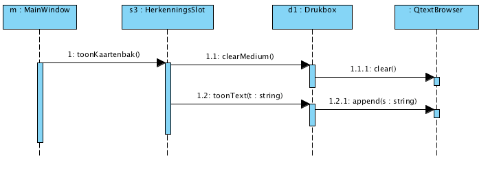

Technische Informatica Header

© John Viser

Laatste wijziging: 26 mei 2026
Opdracht 4
De firma L&B wilt dat een draaideur alleen open gaat voor een beperkt aantal personen die hiertoe bevoegt zijn.
Om dit voor elkaar te krijgen wordt er een nieuw slot ontwikkeld, het HerkenningsSlot, zie figuur 1.
Het HerkenningsSlot wordt voorzien van een kaartenbak. In de kaartenbak staat of iemand wel of niet naar binnen mag. Aan de kaartenbak kunnen ook namen worden toegevoegd van personen die wel of niet naar binnen mogen. Om de inhoud van de kaartenbak af te drukken heeft het HerkenningsSlot een associatie met de Afdrukker-interface, zie figuur 1.
Een afgeleide van de interface Afdrukker is Drukbox. Deze klasse toont de gegevens in de vorm van een string in een QTextBrowser. In figuur 1 wordt hiervan een schematische weergave gedaan.

Een sequence om de kaartenbak te tonen wordt in figuur 2 gedaan.

Figuur 1.Een slot met een kaartenbak.

Figuur 2. Het tonen van de kaartenbak.

    Maak de klasse HerkenningsSlot.
        Implementeer de kaartenbak als een map waarvan de key een string is (de naam van een persoon) en de value een boolean (of de persoon wel of niet naar binnen mag).

        map<String,Boolean> kaartenbak;

        Om het HerkenningsSlot te ontgrendelen, zal dit slot als eerste moeten controleren of de meegegeven naam in de map staat, is dit het geval dan moet de waarde die bij de betreffende naam staat ook true zijn.

    Om een autorisatie toe te voegen aan een HerkenningsSlot kan gebruik worden gemaakt van het component QLineEdit, en twee buttons. ��n button waarop geklikt kan worden als een negatieve autorisatie wordt toegevoegd (een naam en een indicatie dat de betreffende persoon er niet in mag). En ��n button waarop geklikt wordt wanneer een positieve autorisatie wordt toegevoegd (de betreffende persoon mag er wel in).
    Doordat een pointer van het type Slot verwijst naar het object van het type HerkenningsSlot kan de member-functie voegAutorisatieToe(eenNaam :String,toegang :Boolean) niet aangeroepen worden. Om de functie voegAutorisatieToe(eenNaam :String,toegang :Boolean) aan te roepen zal een dynamic_cast moeten plaatsvinden.

    Zet op een draaideur twee sloten, een HerkenningsSlot en een CodeSlot.

    Maak de interface Afdrukker en de klasse Drukbox.
    Laat de inhoud van de kaartenbak zien. Het laten zien van de inhoud van de kaartenbak wordt gedaan door op een button te drukken. Wanneer op de button gedrukt wordt, wordt de inhoud van de kaartenbak door een object van het type Drukbox afgedrukt op een object van het type QTextBrowser.

