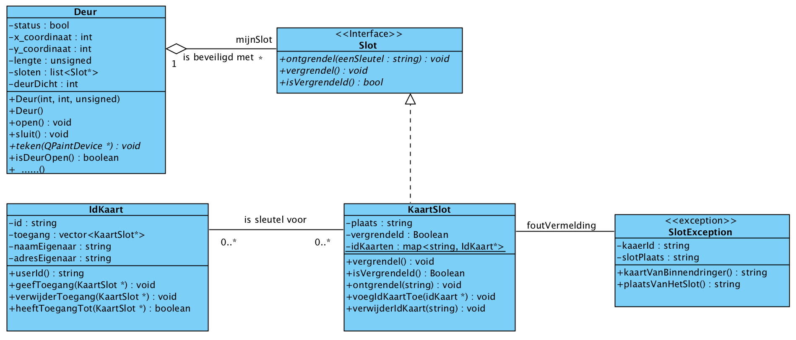
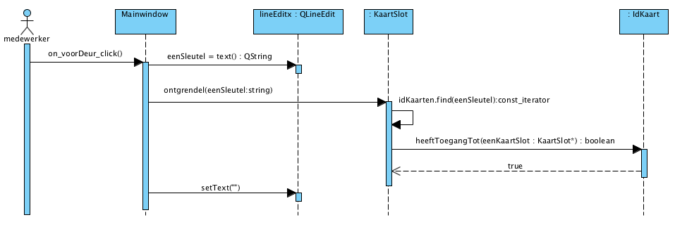

Opdracht 5

Bij de firma L & B wordt besloten dat alleen een naam als identificatie niet meer voldoende is om een slot te ontgrendelen. Er wordt besloten dat iedereen die naar binnen mag een idkaart krijgt. Met deze idkaart kan een slot ontgrendeld worden. Op deze idkaart staat behalve de naam ook het adres van de persoon en welke sloten ontgrendeld mogen worden.

In het klassediagram van figuur 1 zijn de onderlinge relaties weergegeven van Deur, Slot en IdKaart.

Schema van een KaartSlot met een IdKaart

Om met de idkaart een slot te ontgrendelen wordt een kaartslot aangeschaft. Dit slot leest de idkaart en bepaalt of de persoon het slot mag ontgrendelen. In figuur 2 wordt de sequence weergegeven hoe een kaartslot (ks1) ontgrendeld wordt met een IdKaart (idk1).

Figuur2. Sequencediagram van het ontgrendelen van een kaartslot

De klasse KaartSlot: de static data-members / functions.

    In de klasse KaartSlot komt een map te staan naar IdKaart-objecten (deze objecten zullen we later aanmaken). De map is een voorbeeld van de in de les besproken static data members.
    Maak twee methods: voegIdKaartToe(eenIdKaart :IdKaart) en verwijderIdKaart(eenId :String). (We kunnen deze functies pas testen als we ook IdKaart-objecten gemaakt hebben.)

De klasse KaartSlot: maken van objecten.

    In elk KaartSlot-object komt de plaats te staan waar dit wordt geplaatst.
    Maak de drie member functions: ontgrendel(eenSleutel :String), vergrendel() en isVergrendeld(). Laat de inhoud van ontgrendel(eenSleutel :String) voorlopig nog leeg (In de ontgrendel(eenSleutel :String) hebben we nog niet gemaakte IdKaart-objecten nodig).
    Plaats op de schuifdeur en ��n andere deur elk een KaartSlot-object.
    Test dat de deuren met een KaartSlot nu niet meer open gaan (het KaartSlot blijft nl vergrendeld door de lege ontgrendel(eenSleutel :String)).

De klasse IdKaart: aanmaken en bewaren objecten.

    Maak een button om een nieuw IdKaart aan te maken. Wanneer op de button geklikt wordt, wordt er een IdKaart aangemaakt. Gebruik meerdere LineEdit-objecten om gegevens mee te geven bij het aanmaken: een uniek id en de naam en het adres van de eigenaar.
    Gebruik de method voegIdKaartToe(eenIdKaart :IdKaart) van KaartSlot om de aangemaakte IdKaart te bewaren (in alle kaartsloten). Gebruik hierbij als key de unieke id uit de IdKaart.
    Maak een tweede button om een IdKaart te deleten. Wanneer op deze button wordt geklikt, wordt de betreffende IdKaart uit de kaartsloten verwijderd met de methode verwijderIdKaart (eenId :String) van KaartSlot. Om te bepalen welke IdKaart verwijderd moet worden, wordt de unieke id meegegeven waaronder de IdKaart geregistreerd staat.

De klasse IdKaart: autorisatie.

    De sloten die door een IdKaart ontgrendeld mogen worden, zullen worden opgeslagen in een vector in die IdKaart.
    Het toevoegen van een slot kan met de methode geefToegang(eenKaartSlot :KaartSlot).
    De methode verwijderToegang(eenKaartSlot :KaartSlot) zorgt ervoor dat de verwijzing naar het betreffende KaartSlot uit de vector van IdKaart gehaald wordt.
    Plaats twee buttons bij de schuifdeur en gebruik een LineEdit om de id van een IdKaart op tegeven. De ene button moet de ge�dentificeerde IdKaart koppelen aan het KaartSlot van de schuifdeur om toegang te verlenen. De andere button moet de toegang weer verwijderen.

Ontgrendelen.

    Tenslotte maken we de inhoud van de method ontgrendel(eenSleutel :String) in KaartSlot. Wanneer het slot ontgrendeld wordt, wordt de unieke id van de IdKaart als sleutel meegegeven.
    Er wordt in de map gekeken of de unieke id voorkomt.
        Komt deze niet voor. Dan wordt het slot niet ontgrendeld.
        Komt de unieke id wel voor, dan wordt op de bijbehorende IdKaart gekeken of het slot ontgrendeld mag worden.Dit wordt gedaan door de memberfunctie heeftToegang(eenKaartSlot :KaartSlot) van het betreffende IdKaart-object aan te roepen en zichzelf mee te geven als parameter.

Test de beide klassen.

    Maak minimaal 2 IdKaart-objecten aan.
    Geef de gebruiker toegang tot de schuifdeur (gebruiker kan het KaartSlot-object bij de schuifdeur ontgrendelen).
    Ontneem de gebruiker de toegang (gebruiker kan het KaartSlot-object niet meer ontgrendelen)

