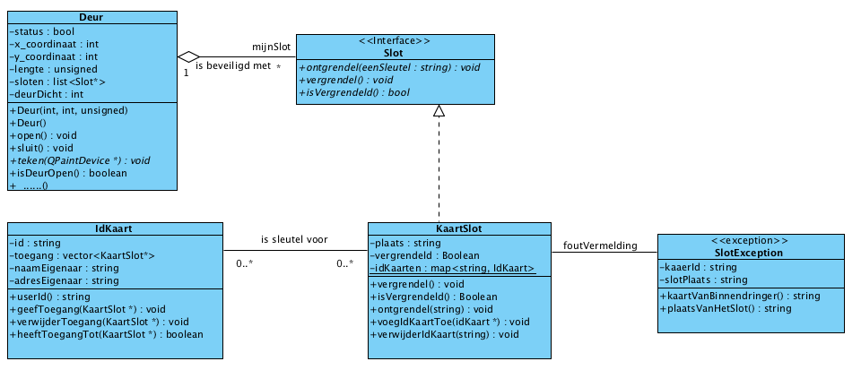

Opdracht 6

Nadat de IdKaart bij de firma L & B werd geintroduceerd, bleek dat het veelvuldig voorkwam dat met een IdKaart geprobeerd werd willekeurige kaartsloten te ontgrendelen. Hierop werd besloten dat bij een mislukte poging om binnen te komen het KaartSlot-object een exception zal afgeven. Deze moet natuurlijk nog wel worden opgevangen.

In het klassediagram van figuur 1 wordt de onderlinge relaties weergegeven van Deur, Slot, KaartSlot, IdKaart en SlotException.

Figuur 1. Schema van een KaartSlot met een IdKaart en SlotException.

Het toepassen van de klasse SlotException.

    In de klasse SlotException komt de plaats waar het KaartSlot-object zich bevindt en de id van het IdKaart-object dat de exception heeft veroorzaakt te staan.

    Wanneer het KaartSlot-object ontgrendeld wordt en de meegegeven id identificeert geen bekende IdKaart, dan wordt een exception gegenereerd met de plaats waar het KaartSlot-object zich bevindt en als id "geen idkaart voor xxxx" waarbij "xxxx" de meegegeven id is.

    Wanneer het KaartSlot-object ontgrendeld wordt en het KaartSlot-object komt niet voor op het IdKaart-object, dan wordt een exeption gegenereerd met het id van het IdKaart-object en de plaats van het KaartSlot-object.

    De exception wordt afgevangen waar het slot ontgrendeld wordt (methode ontgrendel(eenSleutel :String) wordt aangeroepen). De inhoud van het ontvangen object wordt weergegeven.

